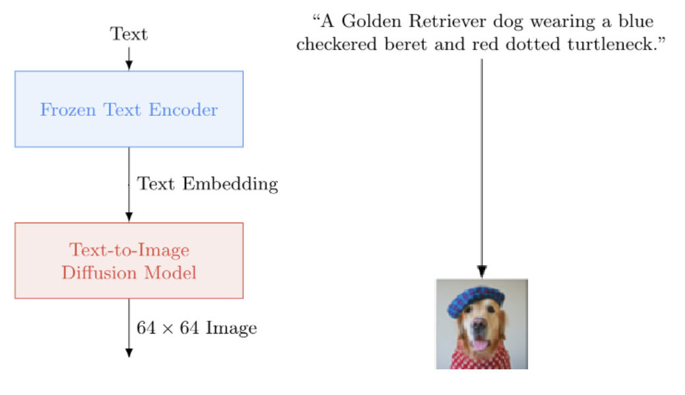
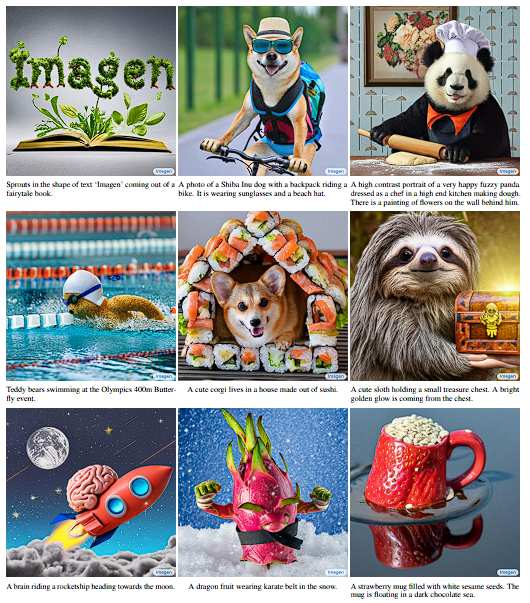
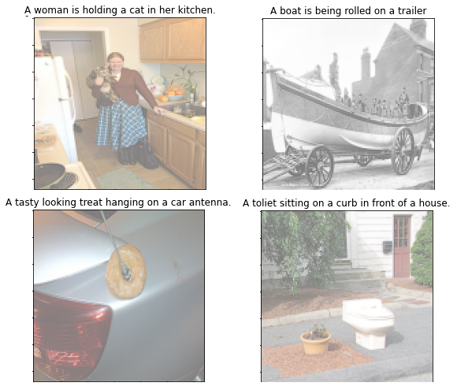

## Tests

:heart_eyes: :heavy_check_mark: <a href="https://colab.research.google.com/drive/1nmauvLLfvQoHaxyP0-s0EqP1qxEO-g2e?usp=sharing">Pt1: Final Evaluating with Small MS COCO and image size of 64x64, using old UNet model</a>

:heart_eyes: :heavy_check_mark: <a href="https://colab.research.google.com/drive/1JOX5qoFdBfBjttHvtk1EGSzGeqt27heX?usp=sharing">Pt2: Final Evaluating with Small MS COCO and image size of 64x64, using old UNet model</a>

:heart_eyes: :heavy_check_mark: <a href="https://colab.research.google.com/drive/1zLaMZXaWABvqz1B5TWh7qh1Fmp-mWiB1?usp=sharing">Final Training with Small MS COCO and image size of 64x64, using old UNet model</a>

:heart_eyes: :heavy_check_mark: <a href="https://colab.research.google.com/drive/1MWSEhyKA2olh-pu8y7WZELDeAjdjPMwb?usp=sharing">First Training with Small MS COCO and image size of 64x64, using old UNet model</a>

:heart_eyes: :heavy_check_mark: <a href="https://colab.research.google.com/drive/1wKscA_G802Yw7FkqsMstUTu_UvtsrgSX?usp=sharing">Overfitting with Small MS COCO and image size of 64x64, using old UNet model</a>

:heart_eyes: :heavy_check_mark: <a href="https://colab.research.google.com/drive/1guq076PV43syt9P5Dmm1T019jIZSJj4x?usp=sharing">Base model that increases resolution from 64x64 to 256x256 with Small MS COCO</a>

:rage: :heavy_multiplication_x: <a href="https://colab.research.google.com/drive/1NCG6JUjbxiUMzCxZgmMrIkIKCTEdps1q?usp=sharing">Training with Fashion MNIST and image size of 28x28, using old UNet model</a>

:rage: :heavy_multiplication_x: <a href="https://colab.research.google.com/drive/1CXsdGN7JuN-JZ9nvq6_fbkealSJ3dQuN?usp=sharing">Training with Small MS COCO and image size of 128x128, using new UNet model</a>

:rage: :heavy_multiplication_x: <a href="https://colab.research.google.com/drive/1_0dDEMMmzBDhrMpughXUP58JBh8Yp4I8?usp=sharing">Training with Small MS COCO and image size of 96x96, using new UNet model</a>

:rage: :heavy_multiplication_x: <a href="https://colab.research.google.com/drive/1r_G1TV0T0TPiRh-o9l4wipZS78fkGyxT?usp=sharing">Training with Small MS COCO and image size of 64x64, using new UNet model</a>

:rage: :heavy_multiplication_x: <a href="https://colab.research.google.com/drive/1Nu_qoCrCH9jnHoQxvP5FA-9ddGt2agBf?usp=sharing">Training with Fashion MNIST and image size of 28x28, using new UNet model</a>


## Imagen - Pytorch

This work is based on Imagen, a Text to Image generator. The main difference between this implementation and the original is the UNets cascade, which is not present in this work. The template created here is similar to the image below

<p align="center">
    </img>
</p>

The implementation of the original image is presented in <a href="https://gweb-research-imagen.appspot.com/">Imagen</a>. the architecture of Imagen is simpler than Google's DALL-E2, but better. It is the new SOTA for text-to-image synthesis.

In the next image, some outputs of Imagen are showed.


<p align="center">
    </img>
</p>

## Install

Use this command to clone the repository for use in Google Colab

```bash
!git clone https://github.com/GuiSilvaPA/TextToImage.git

import sys
sys.path.insert(0,'/content/TextToImage/Imagen')
```

## Simple Usage

### UNet

Don't use `from ComplexModels import UNet` this version will be fixed

```python
from OldComplexModels import UNet

# dim: number base for channels in each convolutional layer
# dim_mults: multplier for each concolutional layer
# text_embed_dim: size o mebdding dimension (512 for small T5)

unet1 = UNet(dim = 64, cond_dim = 512, text_embed_dim = 512,
             dim_mults = (1, 2, 4, 8), num_resnet_blocks = 3,
             layer_attns = (False, True, True, True),
             layer_cross_attns = (False, True, True, True),
             device=device).to(device)

```

### Imagen
```python
from Imagen import Imagen

# image_sizes: size o square image in output
# timesteps: number of timesteps in noise addition
# text_encoder_name: encoder for text

imagen_model = Imagen((unet1,), image_sizes=(64,), timesteps=4000,
                      text_encoder_name = 'google/t5-v1_1-small',
                      cond_drop_prob = 0.3, device=device)
```

### Example of training and image generation
```python

images = torch.randn(4, 3, 64, 64)
texts  = ['A woman is working in a kitchen carrying a soft toy.',
          'A truck carries a large amount of items and a few people.',
          'A boat full of people is on a trailer with wheels.',
          'A pigeon greets three bicyclists on a park path']

# feed images into imagen, compute the loss and train

loss = img(images, texts=texts)
loss.backward()

# for image generation

images = imagen_model.sample(texts = ['a whale breaching from afar',
                                      'fireworks with blue and green sparkles'], cond_scale = 3.)

# the images will have the shape: (2, 3, 64, 64)
```

## Tools for dataset, training, visualization and evaluation

Here, some tools are presented to help the dataset and dataloader creation, the training, the visualization and the evaluation

### CustomDataset and DataLoader

```python
from ImagenTools import CustomDataset, collate_any
from torch.utils.data import DataLoader

train_set = CustomDataset("./TRAIN_IMAGES_coco_5_cap_per_img.hdf5",   # The path for images
                          "./TRAIN_CAPTIONS_coco_5_cap_per_img.json", # The path for captions
                          image_size=64)                              # Resize of the input image

train_loader = DataLoader(train_set, batch_size=4, collate_fn=collate_any)

# Using the next command can show, for example, the images below
imgs, texts = next(iter(train_loader))
```

<p align="center">
    </img>
</p>

### Training

```python
from ImagenTools import ImagenTrainer

# This will build the trainer from epoch 1 to 50, in this configuration the trainer will save each epoch by overwriting the document, but every 10 epochs a new document will be created. In this example, you will have 5 documents from version 1 to version 5, where version 1 corresponds to training from epochs 1 to 10, and the second document is training for epochs 11 to 20.

trainer = ImagenTrainer(imgen_model, epochs = 50, first_epoch=1, p=0, lr = 1e-4,
                        eps = 1e-8, beta1 = 0.9, beta2 = 0.99, device=device)

# Will load a pre-trained version
load.trainer(path)

# Start the training
trainer(train_loader, val_loader)

```

### Visualization

```python
from ImagenTools import get_images

# After training the model, this function shows some images on the left, with reference image on the right and the text used for the generated image. In this way, it is easy to compare the model and qualitatively evaluate

images_out, imgs, texts = get_images(trainer, test_loader, num_imgs=50)

```

### Evaluation with FID

* Formulation
    * $\mathbf{FID} = ||\mu_r - \mu_g||^2 + Tr(\Sigma_{r} + \Sigma_{g} - 2(\Sigma_r \Sigma_g)^{1/2})​$
    * where
        * $Tr$ is trace of a matrix
        * $X_r \sim \mathcal{N}(\mu_r, \Sigma_r)$ and $X_g \sim \mathcal{N}(\mu_g, \Sigma_g)$ are the 2048-dim activations  the InceptionV3 pool3 layer
        * $\mu_r$ is the mean of real photo's feature
        * $\mu_g$ is the mean of generated photo's feature
        * $\Sigma_r$ is the covariance matrix of real photo's feature
        * $\Sigma_g$ is the covariance matrix of generated photo's feature

```python
from ImagenTools import FID

# It is the metric used to evaluate the generated images, based on the comparison with a reference image.

fid = FID(images_out.cpu(),           # Generated Image
          torch.stack(imgs).float())  # Reference Image

```